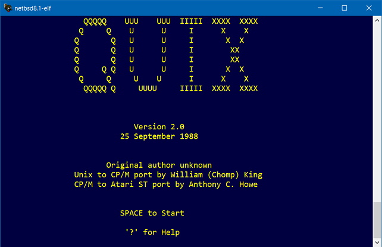
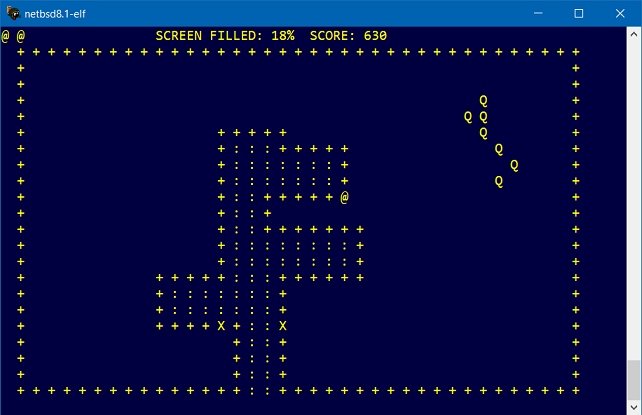

QUIX
====

QUIX (Qix on Unix) is based on the arcade game QIX.  It was originally written in UNIX V7 C.  A friend of mine, William (Chomp) King, found it on the Sydney University machine, and managed to acquire and convert it for BDS C v1.45 under CP/M back in 1983/84.  I later ported it to another CP/M machine in 1985, and much later ported to the Atari ST.  I had the game up and running in a few hours so it is quite simple to move from machine to machine for those of you might be interested in trying it on an Amiga or PC.  

I suspect William's changes was to strip Curses support in favour of hard-coded ADM-3A termainal support, since the Exidy Sorcerer we used had no Curses library and limited RAM.  Since then VT52 and ANSI support has been added.  See `defs.h`.

This is the general release of the source.  It has been tidied up to compile under Sozobon C (Atari ST).  I never did get a chance to add true graphics as I had planned.  I no longer lay claim to maintanence of the source.  However I would like to be kept a breast of improvements.  I far as I know this source is now truely public domain.

THE GAME
--------

The object of the game is firstly to survive and secondly to a mass points by filling in the playing area occupied by the QIX without being speared by a SPARX, fizzed by the FUSE or hit by the QIX.

When the game starts, you'll see a large playing area within which the QIX romes, surrounded by a boarder upon which two SPARXES, `X`, move in opposite directions. Your person, `@`, will be on the bottom boarder edge. For a list of commands type `?`.  This will tell you the default direction keys and other commands to exit and redefine the direction keys.

The direction keys allow you to move along the boarder edge, note that the QIX can not touch you on the boarder but the SPARXs can. Now to achieve the goal of filling or annexing portions of the screen you have to move off the boarder into the playing area and mark out the area you will annex. Take note of you trail you leave behind and the motion of the QIX. If the QIX crosses that trail you mark out, there goes a life. The SPARXES can not touch you till you move back to the edge. At that point in time a new addition will be made to the edge.

Another hazard to avoid is the FUSE. The FUSE shows up if you stop moving while off the boarder or if you try to cross, or double back along your trail. If it gets to you before you get to the edge then thats a life.

When 75% or more of the screen is filled in, you'll recieve a bonus for ever additional percentage over 75, a new game screen and another QIX. With this version, it is now possible to gain points for capturing a QIX by cutting it off from the others. Additional men are awarded every 10,000 points.

That about covers all the game elements without actually demonstrating the game. Anyone who doesn't understand the game, goto a few arcades till you find one that has a QIX machine and observe how it is played (this might be hard to do since the game came out in about '82).

BUGS
----

1) Something may happen if the score rolls over. the game either hangs or stop. Some sort of problem with score reset.

2) Something may happen if you get 10 QIXs on the screen.

The first two bugs where briefly mention by William King sometime around 1983 after he had been beta testing (playing) all night.  He never elaborated on the bugs or fixed them.  He is the only person I know who managed to roll over the score or get 10 qixs on the screen.  Any additional ones that are found please have a go at fixing them or tell me about them.

Note that is fairly simple to alter the configuration of the game.  I had plans for a new version where this is possible (ie.  number of men to start, number of QIXES to start, number of SPARXES, speed adjust).

References
----------

QIX  
<https://en.wikipedia.org/wiki/Qix>
